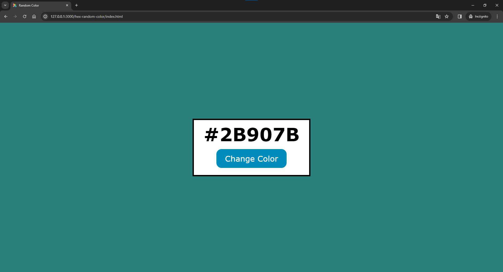
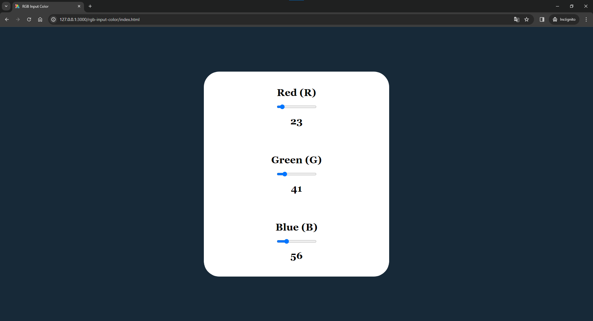
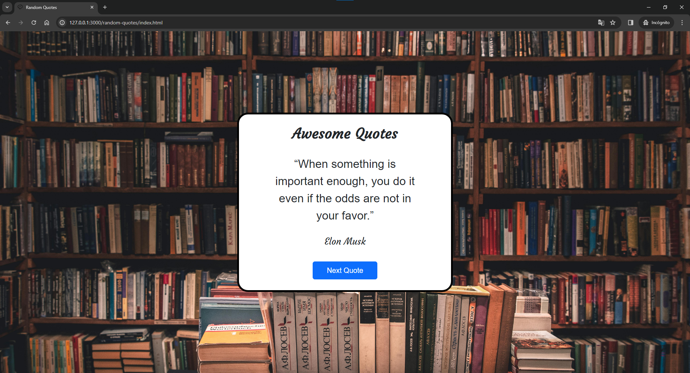
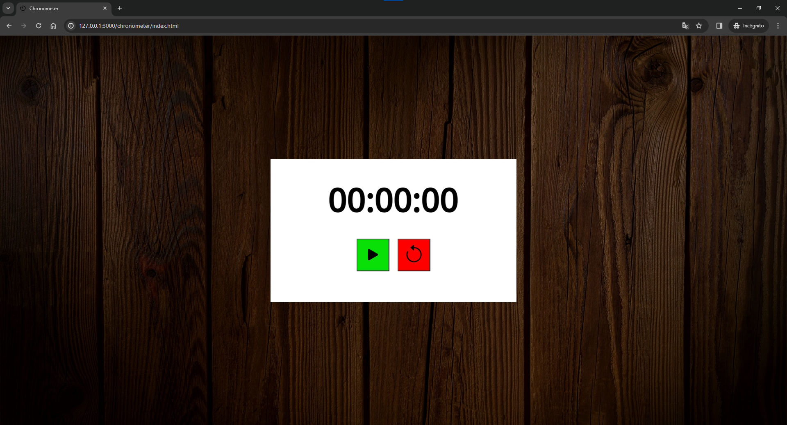
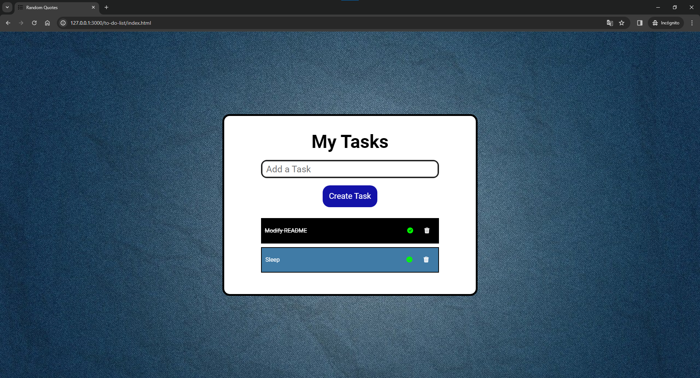

# JavaScript Course for DOM Manipulation

Hey there! This repository contains the source code from the projects I created while learning at the FreeCodeCamp course. 

## Projects 📚

### Random Hexadecimal Color Generator

The first project is about changing the body color using a random hexadecimal color

### RGB Color Picker With Sliders

The second project is not about random colors, but about choosing an RGB Color.

### Random Quote Generator

The third project will show us a random quote with its author.  
(I picked quotes from successful people 😎)

### Chronometer

The fourth project is a chronometer. We can start, pause, and stop it. 

### To Do List App

The last project but my favorite one. We can add a new task clicking on *Add Task* or  
pressing *Enter*. Also we have an icon to define a task as "*done*", and an icon to  
delete it.

